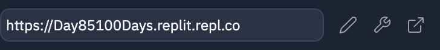

# HTTP & Sessions

One of the main **protocols** (rules that govern how computers communicate) on the web is called **HTTP**.

HTTP is what is known as a **stateless** protocol. This means that it doesn't 'remember' things. 

It's a bit like having a conversation with a goldfish. You can ask a question and get a reply, but when you ask a follow up question, the original has already been forgotten, as has who you are and what you were talking about.

So if HTTP is stateless, how come my news site remembers to give me the weather for my home town, my preferred South American river based online store tells me when it's time to order more multivitamins, and I'm justifiably proud of my #100days success streak?

The answer is.........

## Sessions

Sessions are a way of storing files on your computer that allows a website to keep a record of previous 'conversations' and 'questions' you've asked.

By using sessions, we can store this info about the user to access later. This is really useful when creating things such as login systems.

By default, a session is active until the browser closes, but we can adjust that later on.

👉 Let's get sessions going by importing all the classics: importing `session` and adding a **key** to our app definition.

The key will be used to encrypt the data stored by the session, so that the user can't access it.  The key should be something long, difficult to guess and **not stored in the source code**. I'm going to use the Replit **secrets** feature to store the key.

My key is just a meaningless string, but you can make it whatever you want. Once you create the key, you can choose 'insert' to add it to your code below:


👉 Now I'm going to create the code and insert my key (NOTE: you will need to insert the session key each time you `run` the code):

```python
from flask import Flask, request, redirect, session # extra session import
import os

app = Flask(__name__)
app.secret_key = os.environ['sessionKey'] # new line to include the key, inside [''] is the key you created

@app.route('/')

def index():
  return 'Hello from Flask!'

app.run(host='0.0.0.0', port=81)
```
## Information from the user
👉 Next, I want to get some information from the user, so I've created a quick HTML form and imported it into Flask. Here's the code (but I already did it for you. You're welcome. 😆):

```html
<form method="post" action="setName">
  <p>Name: <input type="text" name="name"></p>
  <button type="submit">Submit</button>
</form>
```
## Import the form page
```python
from flask import Flask, request, redirect, session
import os

app = Flask(__name__)
app.secret_key = os.environ['sessionKey']

@app.route('/')

def index():
########################### NEW BIT
  # Import the form page
  page = ""
  f = open("form.html", "r")
  page = f.read()
  f.close()
  return page
##############################
app.run(host='0.0.0.0', port=81)
```
## Store the name
👉 Now I want to store the name entered by the user in a session.  To do this I will define a page that makes this happen. In the subroutine, I'm going to add this code `session["myName"] = request.form["name"]` which works like a dictionary entry, with a key called `myName` and the value being set to the data from the form.

Then I'm going to send the user back to the homepage using `return redirect("/")`.

Here's the whole code:
```python
from flask import Flask, request, redirect, session
import os

app = Flask(__name__)
app.secret_key = os.environ['sessionKey']

@app.route('/')

def index():
  page = ""
  f = open("form.html", "r")
  page = f.read()
  f.close()
  return page

###### NEW BIT #######################
@app.route("/setName", methods=["POST"])

def setName():
  session["myName"] = request.form["name"]
  return redirect("/")
############################################
app.run(host='0.0.0.0', port=81)
```
## Pull out session data
👉 Now let's see if we can pull that session data out and show it on screen so we can see if it's worked.

To do this, I need to change a few things in the `index` subroutine. Here's the original:

```python
def index():
  # Import the form page
  page = ""
  f = open("form.html", "r")
  page = f.read()
  f.close()
  return page
```

And here's the new version. I've added:
1. An `if` statement to check if that key actually exists.
2. `session.get` to assign the variable if it does.
3.  `+=` To append the data to the page 
```python
def index():
  page = ""
  myName = ""
  if session.get("myName"):
    myName = session["myName"]
  page += f"<h1>{myName}</h1>"
  f = open("form.html", "r")
  page += f.read()
  f.close()
  return page
```

## BIG NOTE

This won't appear to work if you only run it in the mini browser in Replit as it doesn't store session data. You need to open the site in a separate tab (the button on the far right) to test it properly.



