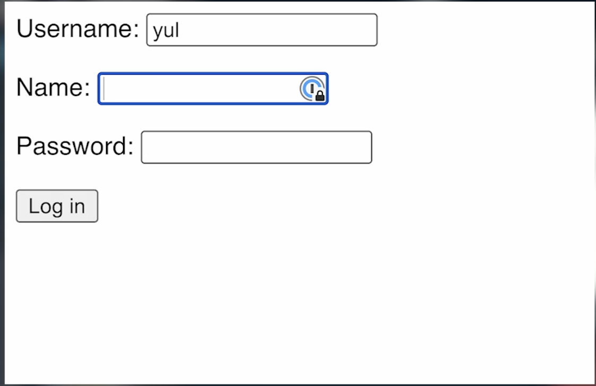

# 👉 Day 85 Challenge

Today's challenge is to extend your login system from yesterday.

Extend it so:

1. It uses the 'sessions' value to store the login information to a `sessions` dictionary on the user's computer.
2. Add a check to see if the sessions data has been set for the username **to every page**.
3. If it hasn't, kick the user back to the login screen.
4. Add a 'logout' button that clears the session data and kicks back to the login page.
5. The user shouldn't be able to go to any page (apart from 'login' unless they are logged in.)
    
Example:

 
 💡 Hints 

  - Use `if form["username"] not in keys` to check whether a user already exists.
  - Try using `if session.get("loggedIn")` to establish login status.

